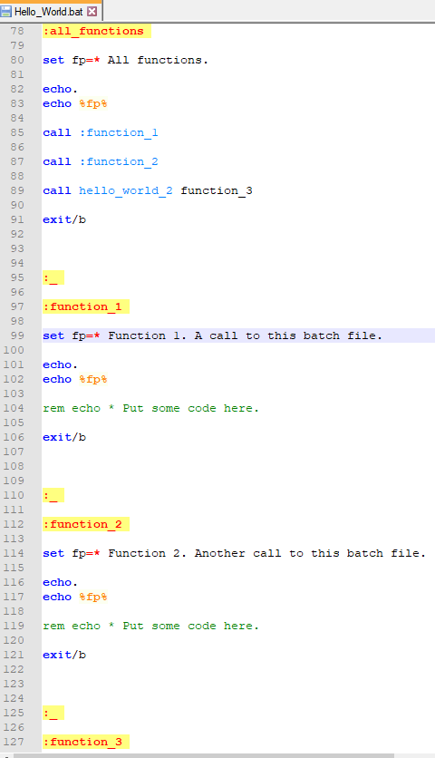

## Composable Batch Files (CBF)

. . . are batch files that are scalable, convention-based and self-documenting that can 
execute a single function or be snapped together like legos to create a whole Millennium 
Falcon script.

## Most Batch Files Are A Mess

Most batch files I've seen in the wild are pretty messy. They are often quite long and not 
well structured. I know this partly because I've written hundreds of them. For years I wrote 
batch files that were big balls of mud. I like to think I'm a little better now.

For Example, I googled "typical batch file" and this was the first hit:

https://www.instructables.com/id/5-Cool-Batch-Files/

I don't know about you, but trying to figure out the control flow of this file gives me a 
headache. This small file has 19 goto statements! And it's not even that bad compared many 
I've seen.

## How to Modularize?

So let's impose some structure. In most programming languages there's a concept of a 
function.

At the heart of Composable Batch Files is the enforcing the use of traditional functions
or code blocks.

#### Anatomy of a function.

Here are the basic structural elements:

**_[label]_** = function name (which must be unique)

**_call :[label]_** = function call to another function in this batch file.

**_goto [label]_** = also a function call, which does not return to the caller.

**_exit/b_** - end of function. The lack of exit/b is the most common culprit. Without ending 
functions, you have spaghetti code.

## A More Structured and Functionalized Approach

Building the batch file around the a set of functions can turn a normally disorganized 
environment into a structured and organized one.

qq-1
