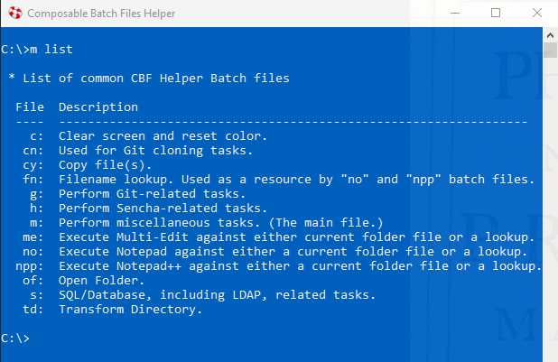
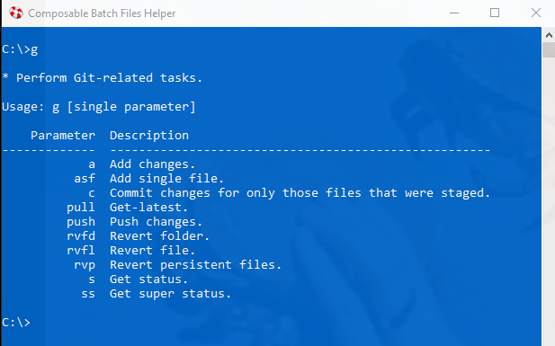

# Composable Batch Files

. . .are scalable, convention-based and self-documenting batch files that can execute a single 
function or be strung together like legos to create a whole Millennium Falcon script.

## Usage

Most of the batch files are run using a single parameter.

For example, running Hello_World.bat in the following way will yield the following output:

To see list of the commonly used composed batch files type qq:

To see the help for a particular batch file type in the batch file name without a 
parameter or add "/?" or a " -help". For example:

To see a brief PowerPoint Presentation on CBF, type:

c:\m ppt