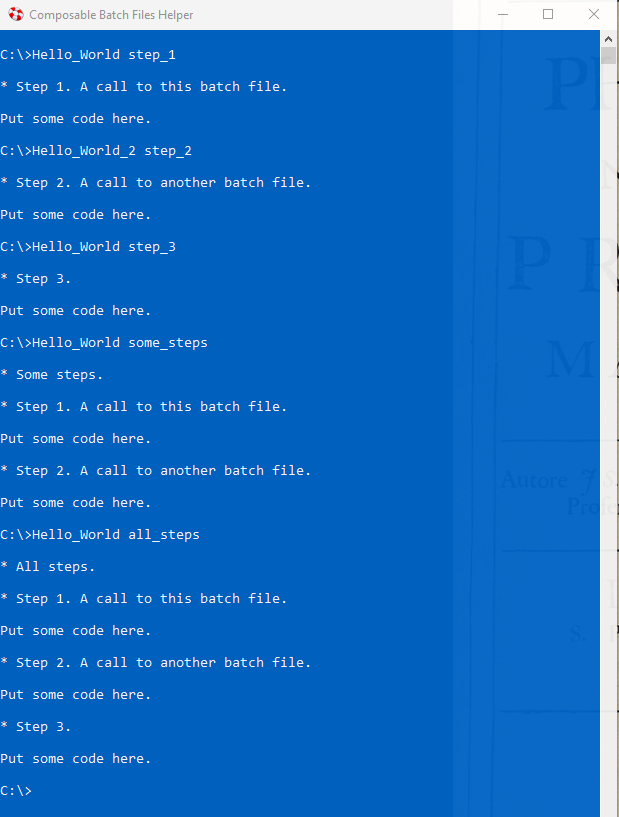
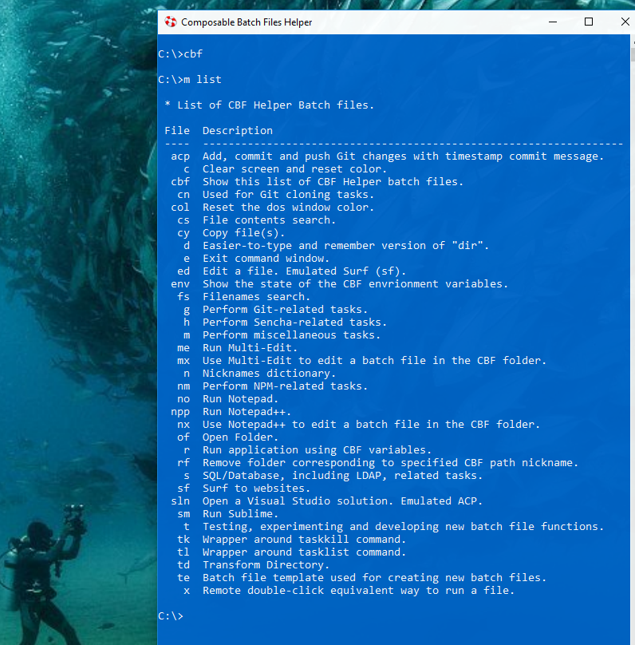

# Composable Batch Files

. . .are scalable, convention-based and self-documenting batch files that can execute a single 
function or be strung together like legos to create a whole Millennium Falcon script.

## Usage

Add %COMPOSABLE_BATCH_FILES% as an environment variable or, at least, add it to your path.

Most of the batch files are run using a single parameter, which usually maps to a batch file
label, which should be unique. Multiple labels can of course be used for a particular code
block.

For example, running Hello_World.bat in the following way will yield the following output:

To see list of the commonly used composed batch files type:

To see the help for a particular batch file, type in the batch file name and "/?" or "-help". 
For example:

To see a brief PowerPoint Presentation on CBF, type:

c:\m ppt