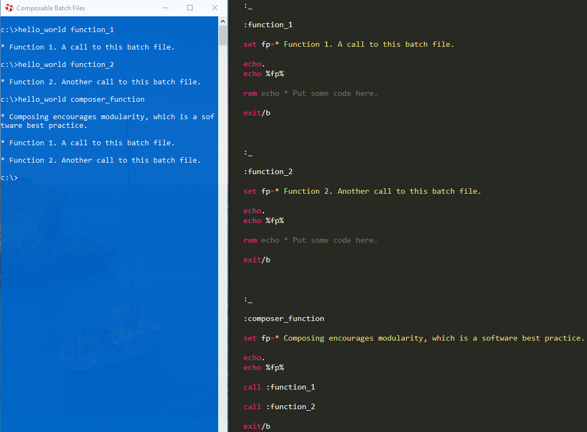
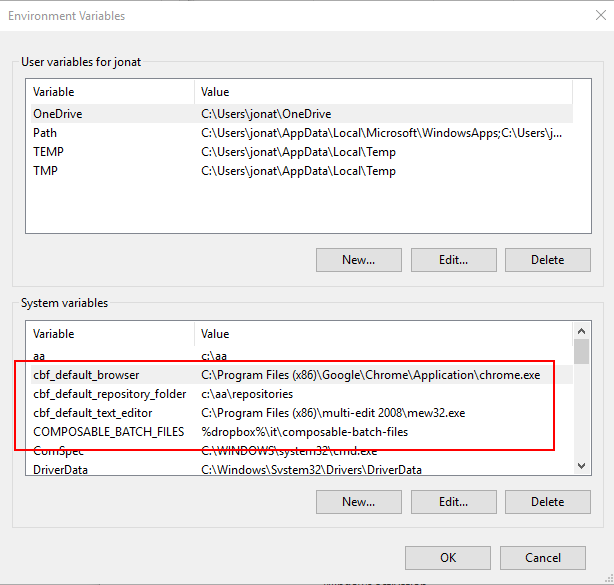
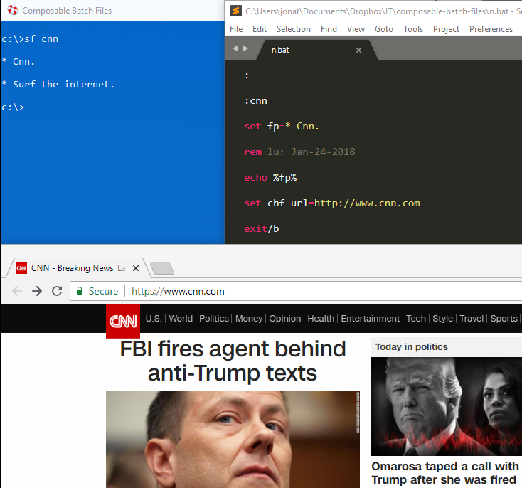

## Composable Batch Files (CBF)

. . . are batch files that are scalable, convention-based and self-documenting that can 
execute a single function or be snapped together like legos to create a whole Millennium 
Falcon script.

## Part I of III - The Problem? Most Batch Files Are A Mess

Most batch files I've seen in the wild are pretty messy. They are often quite long and not 
well structured. I know this partly because I've written hundreds of them. For years I wrote 
batch files that were big balls of mud. I like to think I'm a little better now.

For Example, I googled "typical batch file" and this was the first hit:

https://www.instructables.com/id/5-Cool-Batch-Files/

I don't know about you, but trying to figure out this control flow gives me a headache. This 
small file has 19 goto statements! And it's not even that bad compared to many I've seen.

## Part II of III - Solution is to How to Modularize? Functionalization.

So let's impose some structure. In most programming languages there's a concept of a 
function.

At the heart of Composable Batch Files is enforcing the use of traditional functions or code 
blocks.

#### Anatomy of a function.

Here are the basic structural elements:

**_[label]_** = function name (which must be unique)

**_call :[label]_** = function call to another function in this batch file.

**_goto [label]_** = also a function call, which does not return to the caller.

**_exit/b_** - end of function. The lack of exit/b is the most common culprit. Without ending 
functions, you have spaghetti code.

## A More Structured and Functionalized Approach

Building the batch file around the a set of functions can turn a normally disorganized 
environment into a structured and organized one.

## Hello World - Functionalized

## Setup Instructions

Add %COMPOSABLE_BATCH_FILES% as an environment variable or, at least, add it to your path to 
where you installed the repository.

If you so choose, also add these environment variables for the following:

* %CBF_DEFAULT_BROWSER%

* %CBF_DEFAULT_TEXT_EDITOR%

* %CBF_DEFAULT_REPOSITORY_FOLDER%

For example, here's an example of some CBF environment variables:

After you have cloned or downloaded the CBF repository, double click the shortcut titled 
"Composable Batch Files Helper" to open up a blue command prompt. If you have the environment 
variables set, there is no need to use the blue command prompt, unless you want to. Any 
command prompt will do.

## Menu

All of the batch files in CBF use a functionalized, modular approach. To see a menu of all the 
available CBFs type "menu" or "cbf" at the prompt.

## Getting Help

To get help with a particular batch file, at the prompt type "[batch file name]/?". For 
example:

## Part III of III - Customize CBF by Leveraging Environment Variables

Besides functionalization, another feature CBF promotes is leveraging environment variables in 
order to personalize your CBF user experience. This is achieved by **_mapping_** 
nicknames/function names to environment variables. There is a CBF file named n.bat (Nicknames 
Dictionary) whose sole purpose is to do this mapping. For example, in n.bat, you could add a 
function with the nickname/function name of "docs" which maps the Documents folder to the
cbf_path environment variable. Then because another batch file td.bat (Transform Directory) 
makes use of this mapping, typing "td docs" would navigate to the documents folder.

#### A few more customization examples.

Since of.bat (Open Folder) also leverages the "cbf_path" environment variable, typing "of 
docs" would open the documents folder in Windows Explorer.

Sf.bat (Surf) leverages the "cbf_url" environment variable. So typing "sf cnn" would surf to 
the cnn website.

No.bat (Notepad) leverages the "cbf_filename" environment variable. So typing "no gett" would 
open the file with the nickname, "gett", which is the Gettysburg Address.

So by adding new nickname functions to n.bat, you could customize your environment to make 
folders, websites and filenames you often use to be very easily accessible.

### Now run them all together with "m compose".

