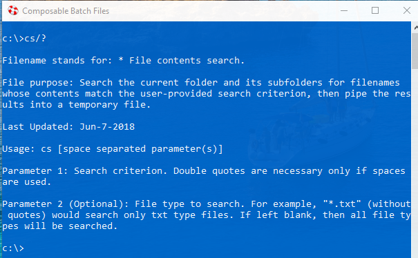

# Composable Batch Files

. . . is a productivity and scripting tool in the form of a collection of batch files that are 
scalable, convention-based and self-documenting batch files that can execute a single function 
or be snapped together like legos to create a whole Millennium Falcon script.

## Most Batch Files Are a Mess

Many batch files I've seen in the wild are pretty messy. They are often quite long and not 
well structured. I know this partly because I've written hundreds like them. I wrote batch 
files for years that were a mess. I like to think I'm a little better now.

qq-1
For Example, I googled "typical batch file" and this was the first hit:

https://www.instructables.com/id/5-Cool-Batch-Files/

I don't know about you, but trying to figure out gives me a small headache. And it's not even 
that bad compared many I've seen.

To see list of the commonly used composed batch files type:

To see the help for a particular batch file, type in the batch file name and "/?" or "-help". 
For example:

To see a brief PowerPoint Presentation on CBF, type:

c:\x ppt